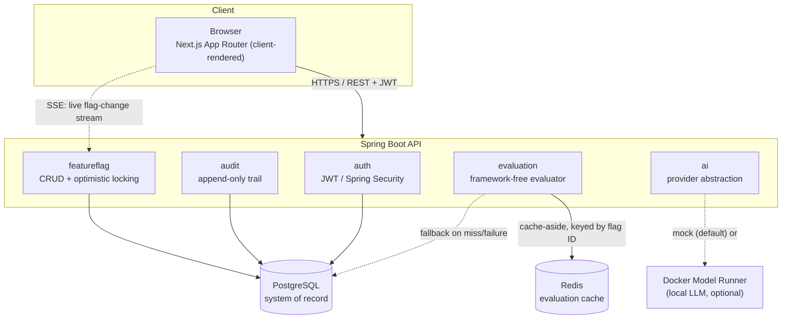

# Feature Flag & Configuration Platform

A platform that lets engineering teams turn features on/off and roll them out gradually, per
environment, without redeploying — feature flags, deterministic percentage rollouts, an
immutable audit trail, an evaluation playground, and an AI assistant that proposes (but never
applies) targeting rules from plain English.

Built as a senior software developer take-home assessment (Project 1: Feature Flag &
Configuration Platform). See [`docs/assessment-compliance.md`](docs/assessment-compliance.md)
for a requirement-by-requirement checklist.

**Once the backend is running** (see [Quick start](#quick-start-docker) below): interactive API
documentation — every endpoint, every possible response, and a working **Authorize** button to
test protected endpoints directly — is at
**[localhost:8080/swagger-ui.html](http://localhost:8080/swagger-ui.html)**.

## Contents

- [Problem & solution](#problem--solution)
- [Architecture](#architecture)
- [Technology stack](#technology-stack--why)
- [Prerequisites](#prerequisites)
- [Quick start (Docker)](#quick-start-docker)
- [Local development (without Docker)](#local-development-without-docker)
- [Environment variables](#environment-variables)
- [Database](#database)
- [Data & log persistence](#data--log-persistence)
- [Demo accounts](#demo-accounts)
- [User management](#user-management)
- [Running tests](#running-tests)
- [API documentation](#api-documentation)
- [AI integration](#ai-integration)
- [Switching the AI model](#switching-the-ai-model)
- [Stretch goals](#stretch-goals)
- [Architecture decisions](#architecture-decisions)
- [Known limitations](#known-limitations)
- [Production readiness](#production-readiness)
- [AI-assisted development disclosure](#ai-assisted-development-disclosure)

## Problem & solution

Shipping a feature behind a flag that requires a full redeploy to toggle is slow and risky.
This platform gives a team a small control plane instead: create a flag, target it at DEV,
turn it fully on; roll it out to 20% of users in PROD while excluding internal staff; watch who
changed what and when; and let a reviewer plug in a user's attributes and see exactly why a
flag resolved the way it did, before shipping the change that reads it.

The core engineering bar this project holds itself to: **rollout membership must be
deterministic** (the same user is always in or always out, never a coin flip per request),
**every configuration change is audited and immutable**, **concurrent edits never silently
overwrite each other**, and **the AI feature can propose configuration but can never apply it**.

## Architecture



- **Evaluation engine** (`evaluation.domain`) is deliberately framework-free — no Spring, no
  HTTP, no JPA. It's the highest-risk business logic in the platform (get it wrong and every
  flag lies to every caller), so it's also the easiest code in the project to unit test
  exhaustively. See [ADR-001](.claude/decisions/ADR-001-evaluation-algorithm.md).
- **Caching** is cache-aside on Redis, keyed by flag ID, with every mutation writing the fresh
  value through in the same request. A Redis outage degrades evaluation to "runs at Postgres
  speed" — verified by hand, not just asserted — never to a failed request. See
  [ADR-002](.claude/decisions/ADR-002-caching-strategy.md).
- **Optimistic concurrency**: every flag update carries the version it was loaded at; a stale
  version is rejected with `409` and the frontend surfaces it explicitly rather than silently
  overwriting someone else's change.
- **Audit trail** is append-only at the type level (`AppendOnlyRepository` has no delete method
  in its hierarchy, not just a convention), written in the same transaction as the change it
  records.
- **AI rule assistant** is a two-layer abstraction (`AiProvider` → `AiRuleAssistantService`) that
  never persists anything — see [ADR-003](.claude/decisions/ADR-003-ai-provider-abstraction.md)
  and [AI integration](#ai-integration) below.
- **Live updates**: `GET /api/v1/flags/stream` (Server-Sent Events) broadcasts a create/update/
  delete notification to every connected client only after the change's transaction commits, so
  the flags list and dashboard refresh without polling. **Evaluation metrics**:
  `GET /api/v1/flags/{id}/metrics` shows evaluation counts per flag/result, read from the same
  Micrometer counters the platform already collects. Both are optional stretch goals — see
  [Stretch goals](#stretch-goals) and
  [ADR-005](.claude/decisions/ADR-005-stretch-goals.md).
- **User management**: an ADMIN creates accounts with a backend-generated password (never
  client-supplied), and accounts are disabled rather than deleted — a user with any flag/audit
  history can't be hard-deleted without violating a foreign key. See
  [User management](#user-management) and
  [ADR-006](.claude/decisions/ADR-006-user-management.md).

### Request trace: evaluating a flag

`Browser` → `POST /api/v1/flags/{id}/evaluate` → `JwtAuthenticationFilter` (validates the bearer
token) → `FeatureFlagController` → `EvaluationService` → `RedisFeatureFlagCache.get(id)` (cache
hit: skip straight to the evaluator; miss: `FeatureFlagRepository.findById` from Postgres,
populate the cache) → `FeatureFlagEvaluator.evaluate` (pure function: disabled check → targeting
rules → deterministic bucket) → `EvaluationResultDto` back to the browser, with a Micrometer
counter/timer recorded on the way out.

## Technology stack & why

| Layer | Choice | Why |
| --- | --- | --- |
| Backend | Java 21, Spring Boot **3.5.16** | Latest stable Boot 3.x — deliberately not 4.1.1, the newest available. Boot 4 defaults to Jackson 3, but springdoc-openapi and jjwt (both used here) haven't caught up yet; running the newest major against an ecosystem that hasn't finished migrating is the wrong trade-off for a project graded partly on reproducibility. Discovered empirically, not assumed — see the `fix(backend): migrate to Spring Boot 3.5.16` commit. |
| Database | PostgreSQL 17, Flyway | Relational integrity for a genuinely relational domain (flags belong to environments, audit rows reference entities); `ddl-auto=validate` — Flyway, not Hibernate, owns schema evolution. |
| Cache | Redis 8 | Sub-millisecond evaluation reads with an explicit invalidation story, not "hope TTL is short enough." See ADR-002. |
| AI | Docker Model Runner (local, free) + a deterministic mock | No API key required to run or demo this project; the mock is the default and is a genuine implementation of the same interface, not a stub. See [AI integration](#ai-integration). |
| Frontend | Next.js 16 (App Router), React 19, TypeScript | Client-rendered SPA-style app talking to a separate backend — no server-side data fetching to speak of, so the App Router's main value here is routing/tooling, not RSC data loading. |
| Styling | Tailwind CSS v4, shadcn/ui (Radix primitives) | CSS-variable-based semantic theming (light/dark via `next-themes`) with a custom indigo/violet brand palette rather than shadcn's neutral defaults — see `frontend/src/app/globals.css`. |
| Server state | TanStack Query | Owns all server state — no ad-hoc `useEffect` fetching anywhere in the app. |
| Tables | TanStack Table (legacy compat hook) | v9 replaced `useReactTable` with a new atom-store `useTable` API; this project only needs core row rendering (pagination/filtering are server-side), so the well-documented v8-compatible `useLegacyTable` was the lower-risk choice — see the doc comment in `components/data-table.tsx`. |
| Forms | TanStack Form + Zod | Client-side validation mirroring the backend's Bean Validation, for fast feedback — the backend remains authoritative. |
| Testing | JUnit 5, Mockito, Testcontainers, Vitest, React Testing Library | 77 backend tests (unit + Testcontainers integration + MockMvc API tests), 23 frontend tests — see [Running tests](#running-tests). |

## Prerequisites

- Java 21+ (only needed if running the backend outside Docker — the Maven wrapper (`./mvnw`)
  handles Maven itself)
- Node.js 20.9+ and [pnpm](https://pnpm.io/) 10+ (only needed if running the frontend outside
  Docker)
- Docker and Docker Compose (v2, i.e. `docker compose`, not `docker-compose`)
- Optional: [Docker Model Runner](https://docs.docker.com/ai/model-runner/) enabled in Docker
  Desktop, only if you want to exercise the real local-LLM AI path instead of the mock

## Quick start (Docker)

```bash
git clone <this-repo-url>
cd "Feature Flag & Configuration Platform"
cp .env.example .env
# Edit .env: set a real JWT_SECRET (openssl rand -base64 48) — there is no
# insecure fallback default on purpose, so the app will not start without one.

docker compose up --build
```

- Frontend: <http://localhost:3000>
- Backend API / Swagger UI: <http://localhost:8080/swagger-ui.html>
- Demo login: `admin@example.com` / `Password123!` (see [Demo accounts](#demo-accounts))

Postgres and Redis data persist in named Docker volumes (`postgres-data`, `redis-data`) across
`docker compose down` / `up` — only `docker compose down -v` discards them.

## Local development (without Docker)

Postgres and Redis still run in Docker (simplest way to get matching versions); backend and
frontend run natively for fast iteration.

```bash
cp .env.example .env   # set JWT_SECRET as above

docker compose up -d postgres redis

cd backend
set -a && source ../.env && set +a
./mvnw spring-boot:run
# -> http://localhost:8080, Flyway migrations + seed data run automatically on boot

# in a second terminal
cd frontend
pnpm install
echo "NEXT_PUBLIC_API_URL=http://localhost:8080" > .env.local
pnpm dev
# -> http://localhost:3000
```

Note: `docker-compose.yml` maps Postgres to host port **5433** and Redis to **6380** by
default, not the standard 5432/6379 — this avoids clashing with Postgres/Redis already running
natively on a dev machine. Adjust `POSTGRES_PORT`/`REDIS_PORT` in `.env` if you'd rather use the
standard ports and don't have a conflict.

## Environment variables

All variables are documented with safe placeholder values in [`.env.example`](.env.example).
The short version:

| Variable | Purpose |
| --- | --- |
| `POSTGRES_DB` / `_USER` / `_PASSWORD` / `_HOST` / `_PORT` | Database connection |
| `REDIS_HOST` / `REDIS_PORT` | Cache connection |
| `JWT_SECRET` | HMAC signing key for access tokens — **required, no default**; generate with `openssl rand -base64 48` |
| `JWT_EXPIRATION_MINUTES` | Access token lifetime (default 60) |
| `CACHE_FLAG_TTL_SECONDS` | Redis TTL safety net for the evaluation cache (default 300) |
| `CORS_ALLOWED_ORIGINS` | Origins the backend accepts browser requests from |
| `AI_PROVIDER` | `mock` (default, no setup) or `docker-model-runner` |
| `AI_BASE_URL` / `AI_MODEL` / `AI_TIMEOUT_MS` | Only used when `AI_PROVIDER=docker-model-runner` |
| `NEXT_PUBLIC_API_URL` | Backend URL the browser calls — baked into the frontend build |

`.env` itself is gitignored — never commit real secrets.

## Database

Flyway migrations live in `backend/src/main/resources/db/migration/` and run automatically on
backend startup:

- `V1`–`V4`: schema (users, environments, feature_flags, audit_logs)
- `V5`: indexes matched to actual query patterns (see the migration file's comments for why
  each one exists — no blanket "index everything")
- `V6`: demo seed data (two users, three environments, eight flags — including one that mirrors
  the assessment's own AI example)

`spring.jpa.hibernate.ddl-auto=validate` — Hibernate only ever checks the schema matches;
Flyway is the only thing that changes it.

## Data & log persistence

### Where Postgres/Redis data actually lives

`docker-compose.yml` uses **named volumes** (`postgres-data`, `redis-data`), not bind mounts to
a project folder — they survive `docker compose down` / `up` and container recreation; only
`docker compose down -v` deletes them. Where those volumes physically live on disk depends on
the host OS, because Docker Desktop on macOS and Windows runs containers inside a lightweight
VM, while Linux's Docker Engine does not:

| OS | Docker setup | Where the volume's files actually are |
| --- | --- | --- |
| **macOS** | Docker Desktop | Inside the Docker Desktop VM's disk image — not a normal macOS path you can `ls`. Use `docker volume inspect` (below) rather than hunting for a file. |
| **Windows** | Docker Desktop (WSL2 backend, the default) | Inside the WSL2 virtual disk, under a path like `\\wsl$\docker-desktop-data\...` — same caveat as macOS: don't go looking for a plain Windows folder. |
| **Linux** | Docker Engine (native, no VM) | A real host path, typically `/var/lib/docker/volumes/<volume-name>/_data` — directly browsable with sufficient permissions. |

The portable, OS-independent way to find a volume regardless of platform:

```bash
docker volume ls | grep feature-flag        # find the exact generated name
docker volume inspect <volume-name>          # "Mountpoint" field shows the path (accurate on
                                              # Linux; on Mac/Windows it's a path *inside* the VM)

# Look inside a volume's contents on any OS without caring where it physically lives:
docker run --rm -v <volume-name>:/data alpine ls -la /data
```

### Changing where data is stored

The simplest change that works identically on every OS: replace the named volume with a **bind
mount** to a host path of your choosing, in `docker-compose.yml`:

```yaml
services:
  postgres:
    volumes:
      - /your/chosen/path/postgres-data:/var/lib/postgresql/data   # was: postgres-data:/var/lib/postgresql/data
```

Do the same for `redis`'s `redis-data:/data` line if you want Redis's append-only file on a
chosen path too (Redis's persisted data is disposable — see
[ADR-002](.claude/decisions/ADR-002-caching-strategy.md) — so this matters far less than doing
it for Postgres). Remove the now-unused `volumes:` top-level block entries if you bind-mount
both.

Alternatively, without touching this project's compose file at all, you can move **all** of
Docker's storage (every project's volumes, not just this one) to a different disk/path:

- **Docker Desktop (macOS/Windows)**: Settings → Resources → Advanced → "Disk image location."
- **Docker Engine (Linux)**: set `"data-root"` in `/etc/docker/daemon.json` (e.g.
  `{"data-root": "/your/path"}`), then restart the `docker` service.

### Application logs

The backend logs to stdout/stderr only (no file appender configured — see
`backend/src/main/resources/logback-spring.xml`): human-readable in the default/local profile,
structured JSON (one line per event, correlation ID included) in the `docker`/`prod` profile.
Running under Docker, that output is captured by Docker's own logging driver (`json-file` by
default), which has the exact same cross-platform location caveat as the volumes above — inside
the Docker Desktop VM on macOS/Windows, at a real path
(`/var/lib/docker/containers/<container-id>/<container-id>-json.log`) on native Linux.

The portable way to read them on any OS, which is the recommended approach rather than hunting
for the raw file:

```bash
docker compose logs backend           # everything since container start
docker compose logs -f backend        # follow, like tail -f
docker compose logs --since 10m backend
```

To persist logs to a host-controlled location outside the container (not configured by default
in this project's lean scope): add a bind-mounted directory to the `backend` service (e.g.
`- /your/chosen/path/logs:/app/logs`) and add a `FileAppender` writing into it in
`logback-spring.xml`, or configure `log-opts` on Docker's `json-file` driver for rotation limits
(unset here, so it uses whatever default the host's Docker daemon has configured).

## Demo accounts

Seeded by `V6__seed_demo_data.sql`, password `Password123!` for both (bcrypt-hashed in the
database, plaintext only here in local dev documentation):

| Email | Role | Can |
| --- | --- | --- |
| `admin@example.com` | `ADMIN` | Everything: create/edit/delete flags and environments, use the AI rule assistant, view audit history |
| `viewer@example.com` | `VIEWER` | Read flags/environments/audit history, use the evaluation playground |

Every mutating backend endpoint checks the role server-side (`@PreAuthorize`) regardless of
what the frontend shows or hides — the frontend hiding a button is a UX nicety, not the
authorization boundary. Verified directly: a VIEWER hitting an ADMIN-only endpoint gets a real
`403`, not just a hidden button (see `FeatureFlagApiTest`).

## User management

An ADMIN can create additional accounts from the **Users** page (sidebar link, ADMIN-only) or via
`POST /api/v1/users` directly. There is no self-service signup and no password field on that
request — a strong password is generated server-side (`SecureRandom`, 16 characters, guaranteed
at least one uppercase/lowercase/digit/symbol) and returned exactly once, in that response, for
the admin to copy and share out of band. Only its bcrypt hash is ever persisted; the plaintext is
never logged and can't be retrieved again after the dialog closes. The new user can change it
themselves afterward from the user menu (**Change password**, top right) — available to any
logged-in account, ADMIN or VIEWER, and requires the current password.

Accounts are **disabled, never deleted** — a user with any flag or audit history can't be
hard-deleted without violating a foreign key (`feature_flags.created_by`/`updated_by` and
`audit_logs.actor_id` all reference `users.id`), and the audit trail must always resolve to a real
actor. A disabled account is rejected at login and — since the account is re-checked from the
database on every request rather than trusted from the token — loses API access on its very next
request, not just at its next login attempt. An admin cannot disable their own account (enforced
server-side, `400` if attempted), so a single-admin deployment can never lock itself out. Full
rationale: [ADR-006](.claude/decisions/ADR-006-user-management.md).

This is explicitly a demo/assessment-scoped feature, not a production user-management system —
see [ADR-006](.claude/decisions/ADR-006-user-management.md) for what was deliberately left out
(email-based password reset, most notably) and why.

## Running tests

```bash
# Backend: 77 tests — unit (evaluation engine, AI validation, correlation ID, SSE broadcast/
# cleanup, password generation), Testcontainers integration (real Postgres/Redis, including a
# real Spring event listener proving flag-change events fire only after commit, and user
# creation/disable/enable), and MockMvc API tests (auth/authz/validation/pagination/metrics/
# streaming/user-management, including a disabled account losing API access mid-session).
cd backend
./mvnw test

# Frontend: 23 tests — evaluation result rendering, AI proposal review flow (including the
# AI-unavailable path), stale-version conflict handling, DataTable loading/empty states, the
# hand-rolled SSE event parser (named/default events, multi-line data, heartbeat comments), and
# the create-user flow (including a clipboard-permission-denied fallback).
cd frontend
pnpm test
```

Both suites are also exercised as part of manual end-to-end verification (real backend + real
Postgres/Redis + real browser) — see the commit history for specific bugs that were caught this
way and not by either automated suite alone (an `@EntityGraph` lazy-loading gap, a
`saveAndFlush` vs `save` version-staleness bug, and a Redis-timeout-too-generous
resilience issue).

## API documentation

Swagger UI: <http://localhost:8080/swagger-ui.html> (raw OpenAPI JSON at `/v3/api-docs`).

Every endpoint documents its request/response shapes and every status code it can return,
including the RFC 7807 `ProblemDetail` shape for errors. Click **Authorize**, paste an access
token from `POST /api/v1/auth/login` (no need to type `Bearer ` — it's added automatically),
and every protected endpoint can be exercised directly from the UI.

## AI integration

**Provider**: `MockAiProvider` (default) — a deterministic keyword parser, not a network call.
It handles the assessment's own canonical example ("enable this for 20% of users in Harare
except internal staff") precisely and falls back to a plain BOOLEAN proposal when it can't
confidently extract a rollout percentage. Set `AI_PROVIDER=docker-model-runner` to use a real
local model instead (`ai/llama3.2`, 2.02GB — chosen deliberately over larger catalog options;
see [ADR-003](.claude/decisions/ADR-003-ai-provider-abstraction.md) for why).

**Prompt strategy**: one system prompt fixing the exact JSON schema
(`strategy`/`rolloutPercentage`/`rules`/`explanation`) and explicitly instructing the model to
treat the user's natural-language input as data to extract from, never as instructions to
itself — a direct prompt-injection mitigation on the one AI-facing input field. See
`AiRuleAssistantService`.

**Output schema**: `RuleProposalDto`, whose `rules` field is typed as the exact same
`TargetingRuleDto` a human-submitted flag's targeting rules are validated as. "AI output goes
through identical validation to human input" is a fact about the code, not a policy that has to
be remembered.

**Validation pipeline**: extract JSON (handles a model wrapping its answer in prose or a
markdown code fence) → deserialize → Bean Validation (operator is a closed enum, attribute must
match a plain-identifier pattern, rollout percentage bounded 0–100) → domain-invariant
validation (the same BOOLEAN-vs-PERCENTAGE_ROLLOUT rule `FeatureFlagService` enforces) → only
then is it returned to the client.

**Failure handling**: every failure mode (provider unreachable, timeout, rate limited, empty
response, malformed JSON, failed validation) collapses to a single `503` with the assessment's
own copy — *"Unable to generate a rule proposal right now. You can configure the rule
manually."* The specific reason is logged server-side with a correlation ID; the client never
learns which internal step failed. 15 backend tests mock the provider and cover every one of
these paths, including all five `AiFailureReason` values.

**The proposal is never saved automatically.** Applying it pre-fills the create-flag form —
strategy, rollout percentage, targeting rules — and a human reviews, optionally edits, and
explicitly submits it through the same `FeatureFlagService` path (same validation, same audit
trail, same optimistic-concurrency check) as any manually-authored flag.

**Cost/latency**: the mock path is instant and free. The Docker Model Runner path runs entirely
on the local machine — no API key, no per-request cost, no data leaving the host; latency
depends on local hardware. Live-verified on this project's own development machine: a
**cold** model (just loaded, or reloaded after Docker Model Runner idles it out) took roughly
14-18 seconds before the first token, even though llama.cpp's own reported inference time was
under a second once warm — see [`AI_TIMEOUT_MS`](#switching-the-ai-model) below.

## Switching the AI model

`AI_PROVIDER=docker-model-runner` isn't tied to one specific model — anything exposed through
Docker Model Runner's OpenAI-compatible `/chat/completions` endpoint works, since
`DockerModelRunnerAiProvider` only ever sends `{model, messages, temperature: 0,
response_format}` and reads back `choices[0].message.content`. Swapping models is a config
change, not a code change:

```bash
# See what's available in Docker's model catalog:
docker model search llama
docker model search qwen

# Pull a different model (this project's default, ai/llama3.2, is already documented in
# ADR-003 — pulling a different one is for trying alternatives):
docker model pull ai/qwen2.5

# Confirm it's actually present locally:
docker model list

# Point the backend at it — edit .env:
AI_MODEL=ai/qwen2.5:latest

# Then restart the backend so it picks up the new value (native run):
cd backend && set -a && source ../.env && set +a && ./mvnw spring-boot:run
# — or, under Docker Compose —
docker compose up -d --build backend
```

**Why `AI_TIMEOUT_MS` defaults to 20000, not something smaller**: measured directly against a
real `ai/llama3.2` call on this project's own development machine — a *cold* model (just
started, or reloaded after Docker Model Runner idles it out from inactivity) took roughly
14-18 seconds before returning a response, even though the model's own reported inference time
(`timings.predicted_ms` in Docker Model Runner's response) was under a second once warm. An 8s
timeout — the more conventional default for an API call — clipped real, successful responses
before they finished. If you switch to a noticeably larger model, expect cold-start latency to
grow further and consider raising `AI_TIMEOUT_MS` accordingly; this has no effect on
`MockAiProvider`, which never makes a network call.

**Structured-output reliability varies by model.** `AiRuleAssistantService`'s validation
pipeline (extract JSON → deserialize → Bean Validation → domain validation) is defensive by
design specifically because a model can wrap its answer in prose, use a markdown code fence, or
occasionally produce a proposal that fails validation outright — any of those collapses to the
same `503`/"configure manually" response rather than a crash or corrupted data (see
[AI integration](#ai-integration) above). If a given model performs poorly at reliably emitting
the exact JSON schema, per [ADR-003](.claude/decisions/ADR-003-ai-provider-abstraction.md) the
documented next thing to try is a model with stronger structured-output track record (`ai/qwen2.5`
was the specific alternative considered), not a code change.

## Stretch goals

Three optional stretch goals from the assessment, all implemented and live-verified (not just
unit-tested) against the real running application — full rationale for each in
[ADR-005](.claude/decisions/ADR-005-stretch-goals.md):

- **Live updates.** `GET /api/v1/flags/stream` (Server-Sent Events, not WebSocket — the traffic
  is one-way, "a flag changed, go refetch," so SSE is the narrower tool that fits, with no
  message-broker dependency added). The frontend's topbar shows a small connected/connecting/
  reconnecting indicator; editing a flag in one browser tab (or via `curl`, or the sample SDK
  client) updates every other connected client's flags list within moments, with no polling and
  no manual refresh. Verified in a real browser: mutated a flag through a separate `curl` call
  while the flags list page sat open, and watched the row update live.
- **Basic evaluation metrics.** `GET /api/v1/flags/{id}/metrics` — evaluation counts grouped by
  result, shown on each flag's detail page, sourced from the same Micrometer counters the
  platform already collects (also visible in raw Prometheus format at `/actuator/prometheus`).
  In-memory, so counts reset on backend restart — an accepted trade-off for a basic operational
  signal, not a durable analytics requirement.
- **Sample SDK client.** [`examples/sdk-client/`](examples/sdk-client/) — a minimal,
  dependency-free Node.js client (plain `fetch`, no `npm install` needed) demonstrating how an
  application would actually consume the evaluation API: authenticate once, evaluate a flag by
  ID with a stable identifier, read metrics, subscribe to the live-update stream. Its demo script
  evaluates a real `PERCENTAGE_ROLLOUT` flag across several identifiers and prints the identical
  true/false pattern on repeated runs — external, outside-the-codebase proof that the rollout
  algorithm really is deterministic (ADR-001), not `Math.random()`.

## Architecture decisions

Full rationale lives in [`.claude/decisions/`](.claude/decisions/):

- [ADR-001](.claude/decisions/ADR-001-evaluation-algorithm.md) — deterministic SHA-256-based
  percentage rollout (never `random()` — the same user must stay on the same side of the line)
- [ADR-002](.claude/decisions/ADR-002-caching-strategy.md) — cache-aside on Redis keyed by flag
  ID, write-through on mutation, graceful degradation on Redis failure
- [ADR-003](.claude/decisions/ADR-003-ai-provider-abstraction.md) — AI provider abstraction,
  model choice, and the validation pipeline
- [ADR-004](.claude/decisions/ADR-004-simple-roles.md) — single-column role instead of a
  users/roles/user_roles join model
- [ADR-005](.claude/decisions/ADR-005-stretch-goals.md) — live updates (SSE, not WebSocket),
  evaluation metrics (read Micrometer back, no second write path), and the sample SDK client's
  scope
- [ADR-006](.claude/decisions/ADR-006-user-management.md) — backend-generated passwords,
  disable-not-delete, and the self-disable guard for admin-managed user accounts

`.claude/CLAUDE.md` and `.claude/current-state.md` hold the fuller running project context this
was built against (mission, non-negotiable rules, phase-by-phase progress).

## Known limitations

Being honest about what a lean, rubric-optimized scope left out or simplified:

- **No dashboard aggregation endpoint.** The dashboard computes stats (total/enabled/disabled
  flag counts, etc.) client-side from a single generously-paginated flags query. Fine at this
  project's demo data volume; a deployment with thousands of flags would want a backend
  aggregation endpoint instead.
- **No server-side flag search/text filter.** Environment filtering is server-side (a real
  query param); a free-text key/name search would need a new backend endpoint, not built here
  given the scope decision to keep the technology surface lean.
- **Environments have no update/delete.** Create + list only — environments are a low-churn
  concept in this domain (DEV/STAGING/PROD), and building unused update/delete endpoints would
  have been complexity without a corresponding need.
- **JWT in `localStorage`, not an httpOnly cookie.** This is a pure client-side SPA talking to a
  separate backend API — there's no Next.js server acting as a backend-for-frontend that could
  set an httpOnly cookie on the same origin. Documented trade-off: a token in `localStorage` is
  readable by any script running on the page (XSS risk), mitigated by a short (1 hour) default
  token lifetime. See `docs/security.md`.
- **No refresh tokens / server-side revocation.** Stateless access tokens only — simpler to
  build and fully horizontally scalable, at the cost of not being able to revoke a single token
  before it expires. Acceptable for a 1-hour default lifetime at this scope.
- **Redis Testcontainers, not a Redis-specific test module.** Integration tests spin up a real
  Redis via a generic Testcontainers `GenericContainer`, which is sufficient here — no dedicated
  `testcontainers-redis` module was needed for the coverage this project wanted.
- **Docker Model Runner: now live-verified end to end, after an earlier failed attempt.** The
  `ai/llama3.2` pull failed partway through more than once earlier in development (a blob
  checksum mismatch after ~10% downloaded, consistent with this development machine's
  unreliable bandwidth throughout the project — not a bug in the platform). On a later, working
  pull, the real model was exercised live through the full stack: `POST
  /api/v1/ai/rule-proposals` against the assessment's own canonical example ("enable this for
  20% of users in Harare except internal staff") returned a correctly-shaped, validated
  `RuleProposalDto`. That run is also what surfaced the `AI_TIMEOUT_MS` cold-start issue
  documented in [Switching the AI model](#switching-the-ai-model). `MockAiProvider` (the
  documented default) remains separately, fully verified live via real browser testing, and is
  still what a reviewer without Docker Model Runner enabled will see with zero setup.
- **`docker compose up --build` was not fully verified end-to-end in this development
  environment**, due to severe local bandwidth constraints during development (a single ~150MB
  base image layer took several minutes at the observed transfer rate). What *was* verified:
  `docker compose config` resolves the full stack cleanly (env var interpolation, healthcheck
  wiring, build args, service dependencies all correct — see the file itself, it's not long);
  the Dockerfiles were reviewed line-by-line for correctness; and the exact same build commands
  each Dockerfile runs (`./mvnw clean package`, `pnpm build`) were run and verified natively,
  with the resulting application extensively tested end-to-end in a real browser. The
  Docker-specific risk still open is narrow: whether the container build steps themselves
  complete without error on a normal connection, which they were architecturally designed to
  (multi-stage, standard base images, no unusual build steps) but were not empirically watched
  finish in this environment. If this matters for evaluation, `docker compose up --build` is
  the first thing to run.

See [Production readiness](#production-readiness) below for what would need to change to run
this for real, beyond a take-home assessment.

## Production readiness

What's already here vs. what a real production deployment would still need:

**Already in place**: stateless JWT auth (horizontally scalable with no shared session store),
Redis as a disposable performance layer with documented graceful degradation, optimistic
concurrency, an immutable audit trail, structured JSON logging in the `docker`/`prod` profile,
correlation IDs propagated end-to-end, RFC 7807 error responses with no leaked internals,
Actuator health/metrics, non-root Docker images, secrets required (never defaulted) in
production config.

**Would need to change for real production traffic**:

| Concern | Now | Would need |
| --- | --- | --- |
| Scaling | Single backend/frontend instance | Both are already stateless — horizontal scaling is just running more instances behind a load balancer, no code change |
| Postgres HA | Single instance, named-volume persistence | Managed Postgres with read replicas + automated backups (point-in-time recovery) |
| Redis HA | Single instance | Redis Sentinel or a managed cluster — the app already treats Redis as fully disposable, so this is additive, not a redesign |
| Observability | Actuator + Micrometer + structured logs | Ship logs/metrics to a real backend (e.g. OpenTelemetry → a vendor or self-hosted stack); today's structured JSON logs are already shaped for this |
| Secrets | `.env` file, required at startup | A real secrets manager (e.g. cloud KMS-backed) instead of environment variables on disk |
| Rate limiting | None | Needed on `/api/v1/auth/login` at minimum (brute-force) and arguably on `/api/v1/ai/rule-proposals` (cost/abuse control if a paid provider were used) |
| Deployment | `docker compose up` | Kubernetes or equivalent, with CI/CD running the test suites above as a merge gate and a rolling/blue-green deploy strategy |
| API gateway / WAF | None (direct to Spring Boot) | A gateway in front for TLS termination, rate limiting, and a first line of defense against common web attacks |

## AI-assisted development disclosure

This project was built with substantial use of Claude Code (Anthropic), operating largely
autonomously across most of the implementation: project scaffolding, backend domain modeling
and the evaluation engine, the caching/audit/AI provider abstractions, the full frontend
(component library setup, all pages and features), the test suites (both backend and frontend),
Docker configuration, and this documentation.

Concretely, Claude Code: made and documented the scope-calibration call behind the lean,
rubric-optimized feature set; wrote most of the source code and tests; ran the actual
application (backend, frontend, Postgres, Redis, and Docker Model Runner) locally throughout
development rather than relying only on type-checking; and used a real headless browser to
click through every major flow by hand, which is how several real bugs were caught — a
Hibernate lazy-loading gap only reachable outside a transaction boundary, a version-staleness
bug from `save()` vs `saveAndFlush()`, a Redis-timeout misconfiguration that made the documented
"graceful degradation" story take 4 seconds instead of tens of milliseconds, an authentication
filter ordering bug that silently dropped correlation IDs and returned the wrong HTTP status on
rejected requests, and two frontend UX rough edges in the AI proposal flow. In a later session
implementing the optional stretch goals, the same practice caught an `AI_MODEL` default that had
silently drifted from what ADR-003 actually documented, and — only reachable by making a real
call against a real pulled model rather than a mocked one — an `AI_TIMEOUT_MS` set too low for a
cold-started local model's real latency; the live SSE flag-change stream was verified the same
way, by mutating a flag through a separate `curl` call while a real browser tab sat on the flags
list page and watching the row update with no manual refresh.

I directed scope, reviewed the resulting architecture and trade-offs throughout, wrote and
edited parts of the implementation myself, and take ownership of and can explain every part of
the submitted implementation.
