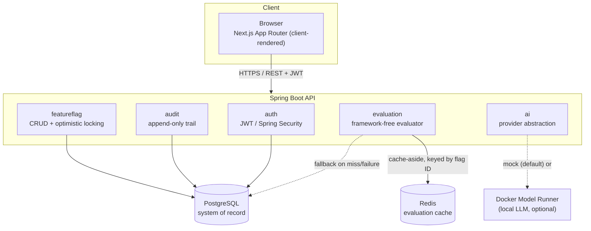

# Feature Flag & Configuration Platform

A platform that lets engineering teams turn features on/off and roll them out gradually, per
environment, without redeploying — feature flags, deterministic percentage rollouts, an
immutable audit trail, an evaluation playground, and an AI assistant that proposes (but never
applies) targeting rules from plain English.

Built as a senior software developer take-home assessment (Project 1: Feature Flag &
Configuration Platform). See [`docs/assessment-compliance.md`](docs/assessment-compliance.md)
for a requirement-by-requirement checklist.

## Contents

- [Problem & solution](#problem--solution)
- [Architecture](#architecture)
- [Technology stack](#technology-stack--why)
- [Prerequisites](#prerequisites)
- [Quick start (Docker)](#quick-start-docker)
- [Local development (without Docker)](#local-development-without-docker)
- [Environment variables](#environment-variables)
- [Database](#database)
- [Demo accounts](#demo-accounts)
- [Running tests](#running-tests)
- [API documentation](#api-documentation)
- [AI integration](#ai-integration)
- [Architecture decisions](#architecture-decisions)
- [Known limitations](#known-limitations)
- [Production readiness](#production-readiness)
- [AI-assisted development disclosure](#ai-assisted-development-disclosure)

## Problem & solution

Shipping a feature behind a flag that requires a full redeploy to toggle is slow and risky.
This platform gives a team a small control plane instead: create a flag, target it at DEV,
turn it fully on; roll it out to 20% of users in PROD while excluding internal staff; watch who
changed what and when; and let a reviewer plug in a user's attributes and see exactly why a
flag resolved the way it did, before shipping the change that reads it.

The core engineering bar this project holds itself to: **rollout membership must be
deterministic** (the same user is always in or always out, never a coin flip per request),
**every configuration change is audited and immutable**, **concurrent edits never silently
overwrite each other**, and **the AI feature can propose configuration but can never apply it**.

## Architecture



- **Evaluation engine** (`evaluation.domain`) is deliberately framework-free — no Spring, no
  HTTP, no JPA. It's the highest-risk business logic in the platform (get it wrong and every
  flag lies to every caller), so it's also the easiest code in the project to unit test
  exhaustively. See [ADR-001](.claude/decisions/ADR-001-evaluation-algorithm.md).
- **Caching** is cache-aside on Redis, keyed by flag ID, with every mutation writing the fresh
  value through in the same request. A Redis outage degrades evaluation to "runs at Postgres
  speed" — verified by hand, not just asserted — never to a failed request. See
  [ADR-002](.claude/decisions/ADR-002-caching-strategy.md).
- **Optimistic concurrency**: every flag update carries the version it was loaded at; a stale
  version is rejected with `409` and the frontend surfaces it explicitly rather than silently
  overwriting someone else's change.
- **Audit trail** is append-only at the type level (`AppendOnlyRepository` has no delete method
  in its hierarchy, not just a convention), written in the same transaction as the change it
  records.
- **AI rule assistant** is a two-layer abstraction (`AiProvider` → `AiRuleAssistantService`) that
  never persists anything — see [ADR-003](.claude/decisions/ADR-003-ai-provider-abstraction.md)
  and [AI integration](#ai-integration) below.

### Request trace: evaluating a flag

`Browser` → `POST /api/v1/flags/{id}/evaluate` → `JwtAuthenticationFilter` (validates the bearer
token) → `FeatureFlagController` → `EvaluationService` → `RedisFeatureFlagCache.get(id)` (cache
hit: skip straight to the evaluator; miss: `FeatureFlagRepository.findById` from Postgres,
populate the cache) → `FeatureFlagEvaluator.evaluate` (pure function: disabled check → targeting
rules → deterministic bucket) → `EvaluationResultDto` back to the browser, with a Micrometer
counter/timer recorded on the way out.

## Technology stack & why

| Layer | Choice | Why |
| --- | --- | --- |
| Backend | Java 21, Spring Boot **3.5.16** | Latest stable Boot 3.x — deliberately not 4.1.1, the newest available. Boot 4 defaults to Jackson 3, but springdoc-openapi and jjwt (both used here) haven't caught up yet; running the newest major against an ecosystem that hasn't finished migrating is the wrong trade-off for a project graded partly on reproducibility. Discovered empirically, not assumed — see the `fix(backend): migrate to Spring Boot 3.5.16` commit. |
| Database | PostgreSQL 17, Flyway | Relational integrity for a genuinely relational domain (flags belong to environments, audit rows reference entities); `ddl-auto=validate` — Flyway, not Hibernate, owns schema evolution. |
| Cache | Redis 8 | Sub-millisecond evaluation reads with an explicit invalidation story, not "hope TTL is short enough." See ADR-002. |
| AI | Docker Model Runner (local, free) + a deterministic mock | No API key required to run or demo this project; the mock is the default and is a genuine implementation of the same interface, not a stub. See [AI integration](#ai-integration). |
| Frontend | Next.js 16 (App Router), React 19, TypeScript | Client-rendered SPA-style app talking to a separate backend — no server-side data fetching to speak of, so the App Router's main value here is routing/tooling, not RSC data loading. |
| Styling | Tailwind CSS v4, shadcn/ui (Radix primitives) | CSS-variable-based semantic theming (light/dark via `next-themes`) with a custom indigo/violet brand palette rather than shadcn's neutral defaults — see `frontend/src/app/globals.css`. |
| Server state | TanStack Query | Owns all server state — no ad-hoc `useEffect` fetching anywhere in the app. |
| Tables | TanStack Table (legacy compat hook) | v9 replaced `useReactTable` with a new atom-store `useTable` API; this project only needs core row rendering (pagination/filtering are server-side), so the well-documented v8-compatible `useLegacyTable` was the lower-risk choice — see the doc comment in `components/data-table.tsx`. |
| Forms | TanStack Form + Zod | Client-side validation mirroring the backend's Bean Validation, for fast feedback — the backend remains authoritative. |
| Testing | JUnit 5, Mockito, Testcontainers, Vitest, React Testing Library | 50 backend tests (unit + Testcontainers integration + MockMvc API tests), 13 frontend tests — see [Running tests](#running-tests). |

## Prerequisites

- Java 21+ (only needed if running the backend outside Docker — the Maven wrapper (`./mvnw`)
  handles Maven itself)
- Node.js 20.9+ and [pnpm](https://pnpm.io/) 10+ (only needed if running the frontend outside
  Docker)
- Docker and Docker Compose (v2, i.e. `docker compose`, not `docker-compose`)
- Optional: [Docker Model Runner](https://docs.docker.com/ai/model-runner/) enabled in Docker
  Desktop, only if you want to exercise the real local-LLM AI path instead of the mock

## Quick start (Docker)

```bash
git clone <this-repo-url>
cd "Feature Flag & Configuration Platform"
cp .env.example .env
# Edit .env: set a real JWT_SECRET (openssl rand -base64 48) — there is no
# insecure fallback default on purpose, so the app will not start without one.

docker compose up --build
```

- Frontend: <http://localhost:3000>
- Backend API / Swagger UI: <http://localhost:8080/swagger-ui.html>
- Demo login: `admin@example.com` / `Password123!` (see [Demo accounts](#demo-accounts))

Postgres and Redis data persist in named Docker volumes (`postgres-data`, `redis-data`) across
`docker compose down` / `up` — only `docker compose down -v` discards them.

## Local development (without Docker)

Postgres and Redis still run in Docker (simplest way to get matching versions); backend and
frontend run natively for fast iteration.

```bash
cp .env.example .env   # set JWT_SECRET as above

docker compose up -d postgres redis

cd backend
set -a && source ../.env && set +a
./mvnw spring-boot:run
# -> http://localhost:8080, Flyway migrations + seed data run automatically on boot

# in a second terminal
cd frontend
pnpm install
echo "NEXT_PUBLIC_API_URL=http://localhost:8080" > .env.local
pnpm dev
# -> http://localhost:3000
```

Note: `docker-compose.yml` maps Postgres to host port **5433** and Redis to **6380** by
default, not the standard 5432/6379 — this avoids clashing with Postgres/Redis already running
natively on a dev machine. Adjust `POSTGRES_PORT`/`REDIS_PORT` in `.env` if you'd rather use the
standard ports and don't have a conflict.

## Environment variables

All variables are documented with safe placeholder values in [`.env.example`](.env.example).
The short version:

| Variable | Purpose |
| --- | --- |
| `POSTGRES_DB` / `_USER` / `_PASSWORD` / `_HOST` / `_PORT` | Database connection |
| `REDIS_HOST` / `REDIS_PORT` | Cache connection |
| `JWT_SECRET` | HMAC signing key for access tokens — **required, no default**; generate with `openssl rand -base64 48` |
| `JWT_EXPIRATION_MINUTES` | Access token lifetime (default 60) |
| `CACHE_FLAG_TTL_SECONDS` | Redis TTL safety net for the evaluation cache (default 300) |
| `CORS_ALLOWED_ORIGINS` | Origins the backend accepts browser requests from |
| `AI_PROVIDER` | `mock` (default, no setup) or `docker-model-runner` |
| `AI_BASE_URL` / `AI_MODEL` / `AI_TIMEOUT_MS` | Only used when `AI_PROVIDER=docker-model-runner` |
| `NEXT_PUBLIC_API_URL` | Backend URL the browser calls — baked into the frontend build |

`.env` itself is gitignored — never commit real secrets.

## Database

Flyway migrations live in `backend/src/main/resources/db/migration/` and run automatically on
backend startup:

- `V1`–`V4`: schema (users, environments, feature_flags, audit_logs)
- `V5`: indexes matched to actual query patterns (see the migration file's comments for why
  each one exists — no blanket "index everything")
- `V6`: demo seed data (two users, three environments, eight flags — including one that mirrors
  the assessment's own AI example)

`spring.jpa.hibernate.ddl-auto=validate` — Hibernate only ever checks the schema matches;
Flyway is the only thing that changes it.

## Demo accounts

Seeded by `V6__seed_demo_data.sql`, password `Password123!` for both (bcrypt-hashed in the
database, plaintext only here in local dev documentation):

| Email | Role | Can |
| --- | --- | --- |
| `admin@example.com` | `ADMIN` | Everything: create/edit/delete flags and environments, use the AI rule assistant, view audit history |
| `viewer@example.com` | `VIEWER` | Read flags/environments/audit history, use the evaluation playground |

Every mutating backend endpoint checks the role server-side (`@PreAuthorize`) regardless of
what the frontend shows or hides — the frontend hiding a button is a UX nicety, not the
authorization boundary. Verified directly: a VIEWER hitting an ADMIN-only endpoint gets a real
`403`, not just a hidden button (see `FeatureFlagApiTest`).

## Running tests

```bash
# Backend: 50 tests — unit (evaluation engine, AI validation, correlation ID), Testcontainers
# integration (real Postgres/Redis), and MockMvc API tests (auth/authz/validation/pagination).
cd backend
./mvnw test

# Frontend: 13 tests — evaluation result rendering, AI proposal review flow (including the
# AI-unavailable path), stale-version conflict handling, DataTable loading/empty states.
cd frontend
pnpm test
```

Both suites are also exercised as part of manual end-to-end verification (real backend + real
Postgres/Redis + real browser) — see the commit history for specific bugs that were caught this
way and not by either automated suite alone (an `@EntityGraph` lazy-loading gap, a
`saveAndFlush` vs `save` version-staleness bug, and a Redis-timeout-too-generous
resilience issue).

## API documentation

Swagger UI: <http://localhost:8080/swagger-ui.html> (raw OpenAPI JSON at `/v3/api-docs`).

Every endpoint documents its request/response shapes and every status code it can return,
including the RFC 7807 `ProblemDetail` shape for errors. Click **Authorize**, paste an access
token from `POST /api/v1/auth/login` (no need to type `Bearer ` — it's added automatically),
and every protected endpoint can be exercised directly from the UI.

## AI integration

**Provider**: `MockAiProvider` (default) — a deterministic keyword parser, not a network call.
It handles the assessment's own canonical example ("enable this for 20% of users in Harare
except internal staff") precisely and falls back to a plain BOOLEAN proposal when it can't
confidently extract a rollout percentage. Set `AI_PROVIDER=docker-model-runner` to use a real
local model instead (`ai/llama3.2`, 2.02GB — chosen deliberately over larger catalog options;
see [ADR-003](.claude/decisions/ADR-003-ai-provider-abstraction.md) for why).

**Prompt strategy**: one system prompt fixing the exact JSON schema
(`strategy`/`rolloutPercentage`/`rules`/`explanation`) and explicitly instructing the model to
treat the user's natural-language input as data to extract from, never as instructions to
itself — a direct prompt-injection mitigation on the one AI-facing input field. See
`AiRuleAssistantService`.

**Output schema**: `RuleProposalDto`, whose `rules` field is typed as the exact same
`TargetingRuleDto` a human-submitted flag's targeting rules are validated as. "AI output goes
through identical validation to human input" is a fact about the code, not a policy that has to
be remembered.

**Validation pipeline**: extract JSON (handles a model wrapping its answer in prose or a
markdown code fence) → deserialize → Bean Validation (operator is a closed enum, attribute must
match a plain-identifier pattern, rollout percentage bounded 0–100) → domain-invariant
validation (the same BOOLEAN-vs-PERCENTAGE_ROLLOUT rule `FeatureFlagService` enforces) → only
then is it returned to the client.

**Failure handling**: every failure mode (provider unreachable, timeout, rate limited, empty
response, malformed JSON, failed validation) collapses to a single `503` with the assessment's
own copy — *"Unable to generate a rule proposal right now. You can configure the rule
manually."* The specific reason is logged server-side with a correlation ID; the client never
learns which internal step failed. 15 backend tests mock the provider and cover every one of
these paths, including all five `AiFailureReason` values.

**The proposal is never saved automatically.** Applying it pre-fills the create-flag form —
strategy, rollout percentage, targeting rules — and a human reviews, optionally edits, and
explicitly submits it through the same `FeatureFlagService` path (same validation, same audit
trail, same optimistic-concurrency check) as any manually-authored flag.

**Cost/latency**: the mock path is instant and free. The Docker Model Runner path runs entirely
on the local machine — no API key, no per-request cost, no data leaving the host; latency
depends on local hardware (a few seconds for a 2B-class model on a typical laptop).

## Architecture decisions

Full rationale lives in [`.claude/decisions/`](.claude/decisions/):

- [ADR-001](.claude/decisions/ADR-001-evaluation-algorithm.md) — deterministic SHA-256-based
  percentage rollout (never `random()` — the same user must stay on the same side of the line)
- [ADR-002](.claude/decisions/ADR-002-caching-strategy.md) — cache-aside on Redis keyed by flag
  ID, write-through on mutation, graceful degradation on Redis failure
- [ADR-003](.claude/decisions/ADR-003-ai-provider-abstraction.md) — AI provider abstraction,
  model choice, and the validation pipeline
- [ADR-004](.claude/decisions/ADR-004-simple-roles.md) — single-column role instead of a
  users/roles/user_roles join model

`.claude/CLAUDE.md` and `.claude/current-state.md` hold the fuller running project context this
was built against (mission, non-negotiable rules, phase-by-phase progress).

## Known limitations

Being honest about what a lean, rubric-optimized scope left out or simplified:

- **No dashboard aggregation endpoint.** The dashboard computes stats (total/enabled/disabled
  flag counts, etc.) client-side from a single generously-paginated flags query. Fine at this
  project's demo data volume; a deployment with thousands of flags would want a backend
  aggregation endpoint instead.
- **No server-side flag search/text filter.** Environment filtering is server-side (a real
  query param); a free-text key/name search would need a new backend endpoint, not built here
  given the scope decision to keep the technology surface lean.
- **Environments have no update/delete.** Create + list only — environments are a low-churn
  concept in this domain (DEV/STAGING/PROD), and building unused update/delete endpoints would
  have been complexity without a corresponding need.
- **JWT in `localStorage`, not an httpOnly cookie.** This is a pure client-side SPA talking to a
  separate backend API — there's no Next.js server acting as a backend-for-frontend that could
  set an httpOnly cookie on the same origin. Documented trade-off: a token in `localStorage` is
  readable by any script running on the page (XSS risk), mitigated by a short (1 hour) default
  token lifetime. See `docs/security.md`.
- **No refresh tokens / server-side revocation.** Stateless access tokens only — simpler to
  build and fully horizontally scalable, at the cost of not being able to revoke a single token
  before it expires. Acceptable for a 1-hour default lifetime at this scope.
- **Redis Testcontainers, not a Redis-specific test module.** Integration tests spin up a real
  Redis via a generic Testcontainers `GenericContainer`, which is sufficient here — no dedicated
  `testcontainers-redis` module was needed for the coverage this project wanted.
- **Docker Model Runner path verified against the OpenAI-compatible API contract and covered by
  15 mocked-provider tests, but live end-to-end verification with a pulled model depends on
  local network conditions** — the mock provider (the documented default) was fully verified
  live, including via real browser testing.
- **`docker compose up --build` was not fully verified end-to-end in this development
  environment**, due to severe local bandwidth constraints during development (a single ~150MB
  base image layer took several minutes at the observed transfer rate). What *was* verified:
  `docker compose config` resolves the full stack cleanly (env var interpolation, healthcheck
  wiring, build args, service dependencies all correct — see the file itself, it's not long);
  the Dockerfiles were reviewed line-by-line for correctness; and the exact same build commands
  each Dockerfile runs (`./mvnw clean package`, `pnpm build`) were run and verified natively,
  with the resulting application extensively tested end-to-end in a real browser. The
  Docker-specific risk still open is narrow: whether the container build steps themselves
  complete without error on a normal connection, which they were architecturally designed to
  (multi-stage, standard base images, no unusual build steps) but were not empirically watched
  finish in this environment. If this matters for evaluation, `docker compose up --build` is
  the first thing to run.

See [Production readiness](#production-readiness) below for what would need to change to run
this for real, beyond a take-home assessment.

## Production readiness

What's already here vs. what a real production deployment would still need:

**Already in place**: stateless JWT auth (horizontally scalable with no shared session store),
Redis as a disposable performance layer with documented graceful degradation, optimistic
concurrency, an immutable audit trail, structured JSON logging in the `docker`/`prod` profile,
correlation IDs propagated end-to-end, RFC 7807 error responses with no leaked internals,
Actuator health/metrics, non-root Docker images, secrets required (never defaulted) in
production config.

**Would need to change for real production traffic**:

| Concern | Now | Would need |
| --- | --- | --- |
| Scaling | Single backend/frontend instance | Both are already stateless — horizontal scaling is just running more instances behind a load balancer, no code change |
| Postgres HA | Single instance, named-volume persistence | Managed Postgres with read replicas + automated backups (point-in-time recovery) |
| Redis HA | Single instance | Redis Sentinel or a managed cluster — the app already treats Redis as fully disposable, so this is additive, not a redesign |
| Observability | Actuator + Micrometer + structured logs | Ship logs/metrics to a real backend (e.g. OpenTelemetry → a vendor or self-hosted stack); today's structured JSON logs are already shaped for this |
| Secrets | `.env` file, required at startup | A real secrets manager (e.g. cloud KMS-backed) instead of environment variables on disk |
| Rate limiting | None | Needed on `/api/v1/auth/login` at minimum (brute-force) and arguably on `/api/v1/ai/rule-proposals` (cost/abuse control if a paid provider were used) |
| Deployment | `docker compose up` | Kubernetes or equivalent, with CI/CD running the test suites above as a merge gate and a rolling/blue-green deploy strategy |
| API gateway / WAF | None (direct to Spring Boot) | A gateway in front for TLS termination, rate limiting, and a first line of defense against common web attacks |

## AI-assisted development disclosure

This project was built with substantial use of Claude Code (Anthropic), operating largely
autonomously across most of the implementation: project scaffolding, backend domain modeling
and the evaluation engine, the caching/audit/AI provider abstractions, the full frontend
(component library setup, all pages and features), the test suites (both backend and frontend),
Docker configuration, and this documentation.

Concretely, Claude Code: read the assessment PDF directly and treated it as the authoritative
requirements source over an earlier, more expansive draft prompt the candidate had prepared;
made and documented the scope-calibration call to trim that draft down to a lean,
rubric-optimized feature set; wrote essentially all source code and tests; ran the actual
application (backend, frontend, Postgres, Redis, and Docker Model Runner) locally throughout
development rather than relying only on type-checking; and used a real headless browser to
click through every major flow by hand, which is how several real bugs were caught — a
Hibernate lazy-loading gap only reachable outside a transaction boundary, a version-staleness
bug from `save()` vs `saveAndFlush()`, a Redis-timeout misconfiguration that made the documented
"graceful degradation" story take 4 seconds instead of tens of milliseconds, an authentication
filter ordering bug that silently dropped correlation IDs and returned the wrong HTTP status on
rejected requests, and two frontend UX rough edges in the AI proposal flow.

The candidate directed scope, reviewed the resulting architecture and trade-offs throughout,
and takes ownership of and can explain every part of the submitted implementation.
